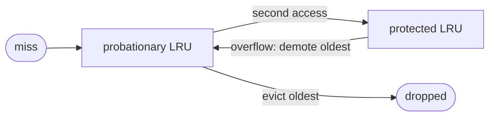
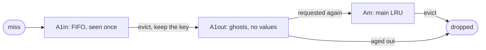
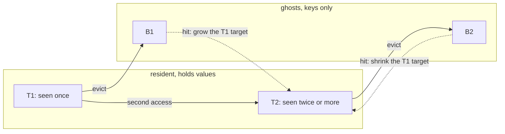

<h1 align="center">
  <br/>
  Evictor
</h1>

<p align="center">
  <b>Thirteen cache eviction policies in Java, behind one interface, measured against each other.</b>
</p>

<p align="center">
  <a href="https://github.com/alxkm/evictor/actions/workflows/gradle.yml"></a>
  <a href="https://github.com/alxkm/evictor/actions/workflows/codeql.yml"></a>
  <a href="https://openjdk.org/projects/jdk/17/"></a>
  <a href="https://opensource.org/licenses/MIT"></a>
</p>

---

## The reason this repository exists

Everyone reaches for LRU. Here is what that costs, on identical traffic, measured by the benchmark
in this repository:

| Policy | zipfian | hot set + scan | loop | scan |
|---|---|---|---|---|
| LRU | 47.7% | 65.8% | **0.0%** | 0.0% |
| LFU | 56.9% | 80.0% | 0.0% | 0.0% |
| FIFO | 43.3% | 55.4% | 0.0% | 0.0% |
| Clock | 48.9% | 69.9% | 0.0% | 0.0% |
| Random | 43.3% | 55.5% | 68.5% | 0.0% |
| MRU | 2.7% | 1.0% | **83.2%** | 0.9% |
| SLRU | 56.8% | **80.0%** | 0.0% | 0.0% |
| 2Q | 55.7% | 76.7% | 71.0% | 0.0% |
| ARC | **57.0%** | **80.0%** | 0.0% | 0.0% |

Hit rate, cache capacity 500, 500,000 requests per pattern. Every run is seeded, so
`./gradlew benchmark` reproduces this table exactly.

Three things worth reading off that table:

- **On a loop just larger than the cache, LRU scores exactly zero.** Not "worse", zero. It evicts
  the entry it is about to need, every single time. MRU, the policy that looks broken everywhere
  else, gets 83.2% on it.
- **A batch scan crossing hot traffic costs plain LRU a fifth of its hit rate** (65.8% against
  80.0%). SLRU, 2Q and ARC hold the working set because a single access is not enough to earn a
  place in them.
- **Nothing beats a pure scan.** When no key is ever read twice, no policy can help, and any
  benchmark that claims otherwise is measuring its own warm-up.

The right eviction policy is a property of your access pattern, and the difference is not a few
percent. This repository implements the alternatives, explains each one, and gives you the harness
to measure them on your own traffic.

## Quick start

```java
CacheService<Long, User> users = Caches.lru(10_000);

users.put(42L, new User("Ada"));
User ada = users.get(42L);                                   // hit
User loaded = users.computeIfAbsent(7L, repository::find);   // load through the cache
```

Switching policy is one word:

```java
Caches.lru(1_000);                                  // recency
Caches.lfu(1_000);                                  // frequency
Caches.arc(1_000);                                  // adaptive, tunes itself
Caches.expiring(1_000, Duration.ofMinutes(5));      // bounded by size and by age
Caches.synchronizedCache(Caches.slru(1_000));       // thread safe view
```

And measuring it is one more:

```java
MonitoredCache<Long, User> users = Caches.monitored(Caches.arc(10_000));
// ... traffic ...
users.stats().hitRate();    // 0.0 .. 1.0
```

## Which policy do I want

| Your workload | Use |
|---|---|
| General purpose, nothing known about the pattern | `lru` |
| A small set of keys is read far more often than the rest | `lfu` |
| Mixed traffic where batch jobs scan through cold keys | `slru` or `twoQueue` |
| The pattern changes over the day and you do not want to tune it | `arc` |
| Entries go stale on their own | `expiring` |
| Write once, read many, and the read path must stay free | `fifo` or `clock` |
| A cyclic scan over data larger than the cache | `mru` |
| A baseline the others have to beat | `random` |

## Implementations

| Class | Policy | put | get | Evicts |
|---|---|---|---|---|
| `LRULinkedHashMapCache` | Least recently used | O(1) | O(1) | The entry untouched for longest |
| `LRUDoublyLinkedListCache` | Least recently used | O(1) | O(1) | The entry untouched for longest |
| `LRUHashMapQueueCache` | Least recently used | O(n) | O(n) | The entry untouched for longest |
| `MRUCache` | Most recently used | O(1) | O(1) | The entry touched last |
| `LFUDoublyLinkedListCache` | Least frequently used | O(1) | O(1) | Lowest access count, LRU on a tie |
| `LFUTreeMapCache` | Least frequently used | O(log n) | O(log n) | Lowest access count, LRU on a tie |
| `FIFOCache` | First in first out | O(1) | O(1) | Oldest insertion, reads ignored |
| `ClockCache` | Second chance | O(1) | O(1) | First unreferenced slot the hand meets |
| `RandomReplacementCache` | Random | O(1) | O(1) | A uniformly random entry |
| `SLRUCache` | Segmented LRU | O(1) | O(1) | The oldest probationary entry |
| `TwoQueueCache` | 2Q | O(1) | O(1) | The FIFO buffer first, the main queue last |
| `ARCCache` | Adaptive replacement | O(1) | O(1) | Recency or frequency, whichever the workload allows |
| `TTLCache` | Time to live plus LRU | O(1)\* | O(1)\* | Expired entries first, then least recently used |

\* amortised, expiration is handled lazily.

Three of them implement the same policy on purpose. `LRULinkedHashMapCache` is twenty lines around
an access ordered `LinkedHashMap`. `LRUDoublyLinkedListCache` does the bookkeeping by hand to show
what the map hides. `LRUHashMapQueueCache` is the version most people write first, with a `HashMap`
and a `Deque` of keys, and it is O(n) per hit because every access scans the deque to find the key.
That is the contrast which explains why the node based variant stores the list node next to the
value.

## How the interesting ones work

### SLRU: one access is not enough

A new entry lands on probation. It reaches the protected segment only on its second access, and
the protected segment demotes rather than evicts. A burst of one-off keys flows through probation
and never touches the working set.



### 2Q: remember what you evicted

Same idea, with a memory. Keys pushed out of the FIFO buffer are recorded in a ghost queue that
holds keys without values, so it costs almost nothing. A key that comes back while its ghost is
alive has proven it is worth keeping and enters the main queue directly.



### ARC: let the workload decide

ARC runs recency and frequency side by side and moves the boundary between them itself. `T1` holds
entries seen once, `T2` entries seen more often, and `B1` and `B2` remember what was just evicted
from each. Every ghost hit is a signal: a hit in `B1` means recency was starved and its share
grows, a hit in `B2` means frequency was starved and it shrinks. Nothing to configure.



### Clock: LRU for the price of one bit

A ring of slots, one reference bit each. A read sets the bit. Eviction walks a hand around the
ring, clearing bits, and takes the first entry whose bit was already clear. It approximates LRU
without relinking anything on the read path, which is why operating systems use it for page
replacement.

### TTL: bounded by age as well as by count

Expiration is lazy and checked on access, and `purgeExpired()` forces the sweep. The time source is
injectable, so expiry is testable without sleeping:

```java
AtomicLong clock = new AtomicLong();
TTLCache<Integer, String> cache = new TTLCache<>(100, Duration.ofSeconds(30), clock::get);

cache.put(1, "one");
clock.addAndGet(Duration.ofSeconds(31).toNanos());
cache.get(1);   // null
```

## The interface

```java
void put(K id, V value);        // insert or replace, may evict
V get(K id);                    // null when absent, counts as an access
void evict(K id);               // explicit removal
int size();                     // current number of entries
int capacity();                 // configured maximum
boolean containsKey(K id);      // presence check, does not count as an access
void clear();                   // drop everything
```

Plus defaults built on those: `isEmpty`, `getOrDefault`, `find`, `computeIfAbsent`.

- `null` is the miss marker, so a cache cannot store a `null` value.
- `capacity` must be positive; the constructors reject anything else.
- `containsKey` deliberately does not refresh recency, so metrics and assertions never disturb the
  eviction order.
- no implementation is thread safe on its own. `SynchronizedCache` serialises access,
  `MonitoredCache` counts hits, misses, writes and evictions. They stack:

```java
MonitoredCache<Long, User> users =
        Caches.monitored(Caches.synchronizedCache(Caches.arc(10_000)));
```

## Design notes

The linked list based policies share one intrusive list in `org.cache.internal`. Each entry carries
its own `prev` and `next` pointers plus the list it belongs to, so unlinking never searches, and
linking the same entry into two lists fails fast instead of corrupting both quietly. That guard
caught a real bug in `TTLCache` during development, where an entry was being tracked in an access
ordered and an expiration ordered list at the same time. `org.cache.internal` is an implementation
detail and carries no compatibility promise.

`CacheContractTest` runs the same suite against all fifteen implementations and decorators: capacity
is never exceeded, a manual eviction frees a slot instead of leaking one, the cache still works
after `clear`, and a mixed workload never returns a value that belongs to a different key.

## Building

```bash
./gradlew build          # compile, test, coverage check
./gradlew benchmark      # the hit rate table above
./gradlew javadoc        # API documentation into build/docs/javadoc
```

Requires JDK 17 or newer. CI builds against JDK 17 and 21 on Linux and JDK 17 on Windows. The build
fails below 80 percent line coverage.

## Contributing

A new eviction policy should implement `CacheService`, come with its own test class, be listed in
`Caches` and in the table above, and pass `CacheContractTest`. See [CONTRIBUTING.md](CONTRIBUTING.md).

## License

MIT, see [LICENSE](LICENSE).
